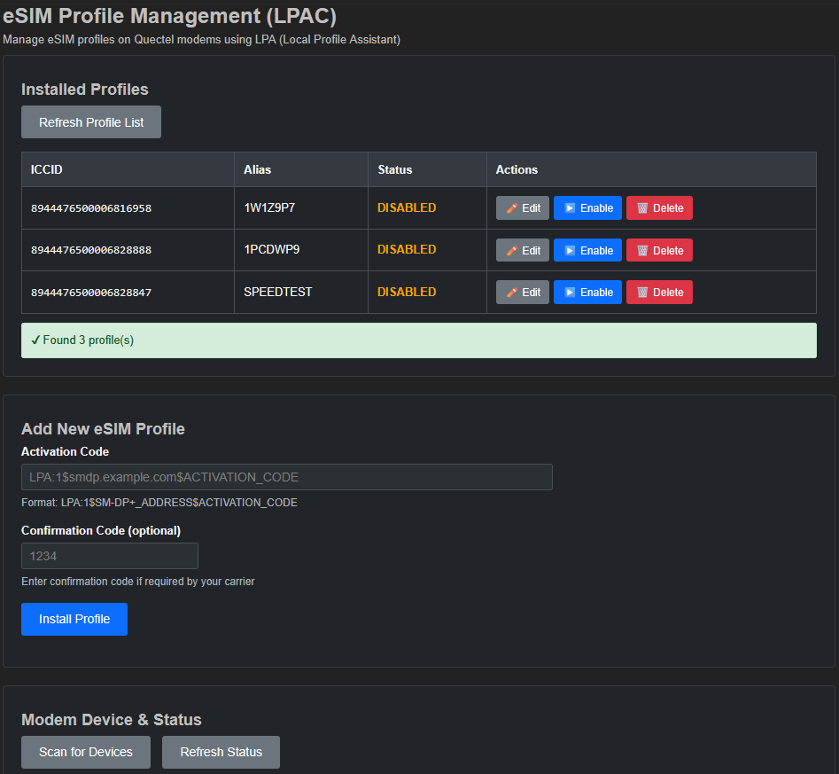
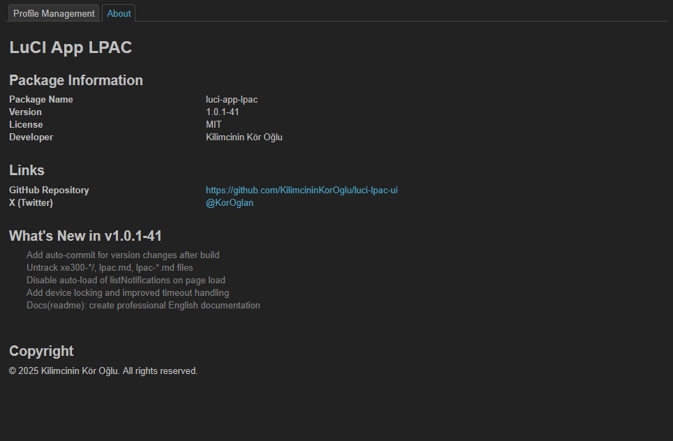

# LuCI App LPAC

## Repo moved to https://github.com/KilimcininKorOglu/luci-app-hermes-euicc

A LuCI web interface for managing eSIM profiles on OpenWrt routers with Quectel modems.

## Overview

LuCI App LPAC provides a user-friendly web interface for eSIM profile management through the LPAC (Local Profile Assistant Client) binary. It enables administrators to manage eSIM profiles directly from the OpenWrt router's web interface, supporting operations such as adding, deleting, enabling, and disabling profiles.

## ⚠️ Important Compatibility Notice

**As of version 1.0.1-62**, this LuCI application is specifically designed to work with the **custom-built lpac binary version 2.3.0-8** (`lpac_2.3.0-8_mips_24kc.ipk`) which includes:

- **OpenSSL backend** (instead of mbedTLS) to resolve TLS 1.3 handshake issues
- **AT and uQMI driver support** enabled
- **LPAC_DRIVER_HOME** environment variable support for driver discovery

**Compatibility Warning:**

- The official lpac package from OpenWrt repositories **may not be compatible** with this LuCI app version
- Using mismatched versions may result in:
  - TLS/SSL connection failures with eSIM providers
  - Driver discovery issues
  - Missing environment variable support
  - Unexpected behavior in advanced settings

**Recommendation:**

- Always use the matching lpac binary build (`lpac_2.3.0-8_mips_24kc.ipk` or later) from this repository
- If using OpenWrt 24.10.x, the custom OpenSSL-based build is **required** due to mbedTLS 3.6.5 RSA-PSS signature regression

## Screenshots

### Dashboard - Profile Management



The main dashboard displays all eSIM profiles with their status, ICCID, provider, and nickname. Each profile has action buttons for editing, enabling/disabling, and deletion.

### About Page



The About page shows package information, version details, and recent changelog entries.

## Features

### Core Functionality

- List all eSIM profiles with detailed information (ICCID, state, nickname, provider)
- Enable and disable eSIM profiles
- Delete profiles from the eUICC
- Add new profiles via activation codes
- Set custom nicknames for profiles
- Real-time profile status monitoring
- Automatic GSMA notification processing

### Driver Support

- AT (Standard AT commands)
- AT_CSIM (AT+CSIM commands)
- MBIM (Mobile Broadband Interface Model)
- QMI

### Architecture

- Classic LuCI template-based design
- Seamless integration with OpenWrt themes
- Standard fieldset structure following OpenWrt UI guidelines
- JSON-based communication with lpac binary
- UCI configuration system integration

## Requirements

### Runtime Dependencies

- OpenWrt 21.02 or later
- luci-base
- luci-compat
- lpac binary (eSIM profile management client)
- curl or wget (for HTTP communication)
- Quectel modem with eSIM support

### Build Dependencies

- bash
- tar
- gzip
- sed
- awk
- perl

## Installation

### From IPK Package

1. Download the latest IPK package from releases
2. Transfer to your router
3. Install using opkg:

```bash
opkg install luci-app-lpac_*.ipk
```

4. Clear LuCI cache (done automatically by postinst script):

```bash
rm -rf /tmp/luci-modulecache/* /tmp/luci-indexcache/*
```

5. Refresh your browser and navigate to: Network > LPAC eSIM

### From Source

1. Clone this repository
2. Navigate to the LuCI app directory and run the build script:

```bash
cd luci-app-lpac
./build.sh
```

3. Install the generated IPK package

## Configuration

The package uses UCI for configuration. Edit `/etc/config/lpac`:

```bash
config settings 'device'
    option driver 'at'              # at, at_csim, mbim, qmi
    option at_device '/dev/ttyUSB2'
    option mbim_device '/dev/cdc-wdm0'
    option qmi_device '/dev/cdc-wdm0'
    option http_client 'curl'       # curl or wget
```

### Configuration Options

- **driver**: Communication driver (at, at_csim, mbim, qmi)
- **at_device**: AT modem device path (for AT/AT_CSIM drivers)
- **mbim_device**: MBIM device path (for MBIM driver)
- **qmi_device**: QMI device path (for QMI driver)
- **http_client**: HTTP client to use (curl or wget)

## Build System

### Automated Build Features

The build system includes comprehensive automation to ensure consistency and reduce manual maintenance:

#### 1. Version Management

- Auto-increments build number based on existing IPK files
- Updates PKG_RELEASE in Makefile
- Synchronizes version across all files before building

#### 2. Metadata Synchronization

- Extracts package information from Makefile (single source of truth)
- Automatically updates about.htm with:
  - Package name
  - Version number
  - License information
  - Developer name

#### 3. Changelog Generation

- Parses recent git commit messages
- Filters meaningful commits (excludes version bumps and chores)
- Extracts descriptions from conventional commit format
- Auto-generates "What's New" section in about.htm
- Displays up to 5 recent changes

### Build Process

Run the build script from `luci-app-lpac/` directory:

```bash
cd luci-app-lpac
./build.sh
```

The script performs the following steps:

1. Determines next build number by scanning existing IPK files
2. Updates Makefile with new PKG_RELEASE
3. Extracts metadata from Makefile
4. Generates changelog from git commits
5. Updates about.htm with version, metadata, and changelog
6. Creates directory structure
7. Copies LuCI files (controller, views, scripts)
8. Verifies file formats (Unix line endings)
9. Creates package metadata (control file, postinst, prerm scripts)
10. Builds IPK package with correct structure
11. Verifies IPK integrity

### Build Output

The build creates an IPK package in the project root:

```bash
luci-app-lpac_1.0.1-N_all.ipk
```

Where N is the auto-incremented build number.

## File Structure

```bash
luci-app-lpac/
├── build.sh                          # Automated build script
├── Makefile                          # OpenWrt package definition
├── luasrc/
│   ├── controller/
│   │   └── lpac.lua                  # LuCI controller
│   └── view/
│       └── lpac/
│           ├── profiles.htm          # Main profile management page
│           └── about.htm             # About page with version info
└── root/
    ├── usr/bin/
    │   └── lpac_json                 # Wrapper script for lpac binary
    └── etc/config/
        └── lpac                      # UCI configuration file
```

## Usage

1. Access the web interface at: `http://router-ip/cgi-bin/luci/admin/network/lpac`
2. Configure your modem settings in the About tab
3. Return to Profiles tab to view and manage eSIM profiles
4. Use action buttons to enable/disable/delete profiles
5. Enter activation code to add new profiles
6. Set custom nicknames for easier identification

## Troubleshooting

### SSL/TLS Errors (OpenWrt 24.10.x Regression)

**Problem**: Profile download fails with "HTTP transport failed" or "SSL - Client received an unsupported extension" error on OpenWrt 24.10.x.

**Root Cause**: OpenWrt 24.10.x has a confirmed regression in curl/mbedTLS lacking RSA-PSS signature support for TLS 1.3. This affects modern SM-DP+ servers. See: <https://github.com/openwrt/packages/issues/25921>

**Automatic Workaround**: The package automatically enables `LIBEUICC_DEBUG_HTTP=1` in the `lpac_json` wrapper script, which works with ~70% of SM-DP+ servers (e.g., consumer.e-sim.global).

**Recommended Solution** (for full compatibility):

Downgrade to OpenWrt 23.05.5 curl packages:

```bash
cd /tmp
wget https://downloads.openwrt.org/releases/23.05.5/packages/mips_24kc/packages/curl_8.11.1-r1_mips_24kc.ipk
wget https://downloads.openwrt.org/releases/23.05.5/packages/mips_24kc/base/libcurl4_8.11.1-r1_mips_24kc.ipk
opkg install --force-downgrade *.ipk
```

**Note**: Replace `mips_24kc` with your router's architecture if different (check with `opkg print-architecture`).

### MatchingID Refused Error

**Error**: "MatchingID is refused" during profile download

**Cause**: The activation code was created for a different eUICC (EID mismatch)

**Solution**: Request a new activation code from your eSIM provider for your device's EID. You can find your EID in the "Modem Device & Status" section.

## Development

### Commit Message Format

This project uses conventional commits for automated changelog generation:

```bash
emoji type(scope): description

Examples:
feat(ui): add profile nickname support
fix(driver): resolve MBIM communication timeout
docs(readme): update installation instructions
```

### Contributing

1. Fork the repository
2. Create a feature branch
3. Make your changes following the commit message format
4. Test the build process
5. Submit a pull request

## License

This project is licensed under the MIT License. See the LICENSE file for details.

## Maintainer

Kilimcinin Kör Oğlu

- Email: <k@keremgok.tr>
- GitHub: <https://github.com/KilimcininKorOglu/luci-lpac-ui>
- X (Twitter): @KorOglan

## Acknowledgments

- OpenWrt project for the robust embedded Linux platform
- LuCI team for the web interface framework
- LPAC project for the eSIM management client
- Quectel for modem hardware and documentation

## Support

For issues, questions, or contributions, please visit:
<https://github.com/KilimcininKorOglu/luci-lpac-ui/issues>

## Changelog

Recent changes are automatically generated from git commits and displayed in the About page of the web interface. For detailed history, see the git commit log.
